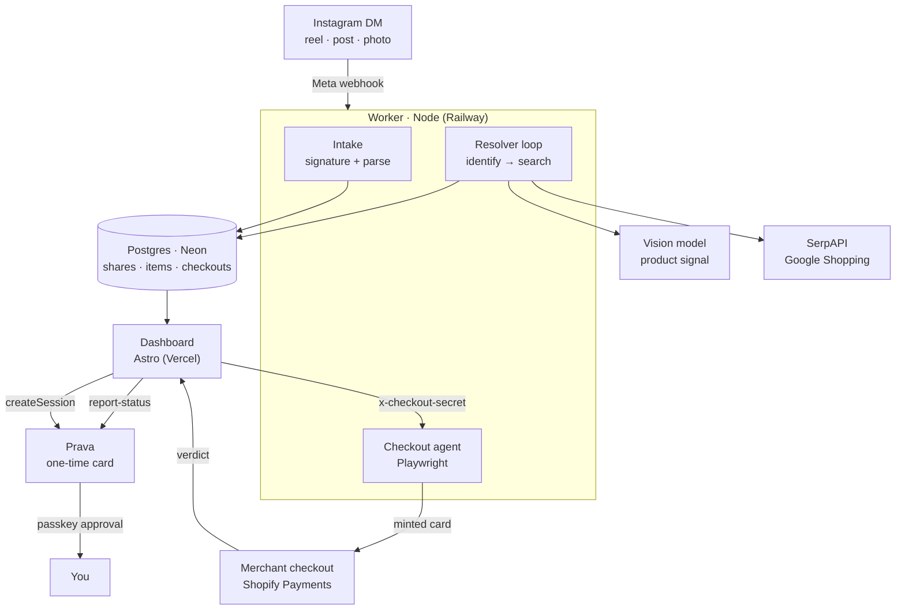

<div align="center">


# sendit

### DM a reel. Get the product. Buy it without ever leaving the chat.

*You message a WhatsApp number (or an Instagram account) — a link to the post or a screenshot of the product. An agent identifies the product, finds it on real storefronts, and checks out with a [Prava](https://prava.space) one-time card that only works once, at that merchant, for that amount.*

[](https://astro.build)
[](https://www.typescriptlang.org/)
[](https://neon.tech)
[](https://playwright.dev)
[](https://docs.prava.space)
[](https://developers.facebook.com/docs/instagram-platform)
[](#-license)

[**Live App**](https://sendit.vercel.app) · [**Dashboard**](https://sendit.vercel.app/dashboard) · [**Privacy**](https://sendit.vercel.app/privacy)

</div>

---

## What is sendit?

You see something in a reel. Screenshotting it, reverse-image-searching it, guessing the brand, finding a store that ships to you — that's the whole reason you never buy it.

sendit collapses that into one gesture. **DM the post.** The agent pulls the frame, works out what the product is, finds it on real storefronts, and puts it on your dashboard. When you tap buy, Prava mints a **single-use, merchant-locked, amount-scoped** card and an agent drives the merchant's actual checkout with it.

Nothing about that requires the merchant to integrate with anything. No affiliate deal, no API partnership, no SDK on their side — the agent checks out the way a person does.

> **Why the card matters:** an agent typing a card into a stranger's checkout is exactly the case a normal card is worst at. Store a real PAN and you're in PCI scope, the user has no spending bound, and every chargeback is yours. Prava's credential is worthless if it leaks — it spends once, at one merchant, for one amount — and the passkey is cryptographic proof that a human approved *this* purchase. Prava isn't the payment method here; it's the authorization layer that makes agentic buying safe enough to say yes to.

---

## Features

### Intake
- **Reels, posts, and photos** — shared feed posts (`ig_post`) and photos carry a directly fetchable CDN image; reels carry only a permalink, so the keyframe is read from the post's `og:image`. No oEmbed, no app review.
- **Signature-verified webhooks** — `X-Hub-Signature-256` checked against raw bytes, because re-serialised JSON has different bytes and would silently fail.
- **Persist before ack** — a DB failure returns a retryable 500 instead of a silently dropped share. Retries are safe: a dedupe index makes intake idempotent.
- **Claim by handle** — sign in with your email and your Instagram handle; the IGSID is resolved from the account's own conversations and every share you've sent moves onto your account.

### Resolution
- **Vision identify** — the keyframe and caption go to a multimodal model that returns a structured signal: brand, product type, colour, distinguishing features, and a shopping-engine query. Material is named explicitly ("denim", "linen") because it narrows a search far more than colour does.
- **Real storefronts** — Google Shopping via SerpAPI, then a second call per candidate to resolve the **actual merchant URL**; Google only ever hands back its own redirect page, and nothing can be bought on `google.com/search`.
- **Recall fallback** — an over-specific query matches nothing at all, so a miss retries once on the coarse description before giving up. A *similar* match beats an empty card.
- **Sent beside matched** — the dashboard shows the frame you sent next to what it found. A match is unjudgeable without the source.

### Payments
- **Session → passkey → mint → settle** — the full Prava journey, wired end to end: `createSession`, hosted approval, `payment-result`, `report-status`.
- **Guardrails made visible** — the checkout page states them in the user's terms: works once, locked to this merchant, capped at this amount, real card never sent to the merchant or to us.
- **Stale-enrolment purge** — cards are cleared before every session. A card stored without a bound passkey permanently traps a customer on the `savedCard` path, which no refresh or restart clears.
- **Ownership-scoped** — every checkout is recorded locally, so a Prava session id is verifiable and nobody can poll or settle someone else's purchase.

### Checkout agent
- **Drives the real checkout** — product → cart → contact → shipping → card fields → pay, on the merchant's own site, with the minted card.
- **Cart permalinks first** — `/cart/<variant>:1` needs no variant selection and no theme-specific DOM; add-to-cart buttons are usually visible but unclickable until a size is chosen.
- **Honest outcomes** — a gateway decline, a sold-out product, a Shop Pay prompt, a captcha wall, and a merchant dropping the connection are five different things, and the agent names each one.
- **Human-in-the-loop captcha** — a captcha is the merchant asking for a human. When the browser is visible, the agent hands it over and resumes, rather than trying to defeat it.

---

## 🏛️ Architecture

Two deploys, one pipeline. The Astro app is serverless on Vercel; the worker is a long-running Node service (it holds a poll loop and drives a real Chromium, so it can't be serverless).



**The data model:**

| Table | Role |
|-------|------|
| **users** | Account + saved shipping address (typed once, reused) |
| **identities** | Platform handle → user. An IGSID has no relation to a phone number, so binding is a one-time link step |
| **shares** | One DM. Raw payload, the identified frame, status, resolution |
| **items** | Ranked matches for a share — merchant, price, product URL |
| **checkouts** | One Prava session. Without it, a session id is unverifiable |

---

## How the pipeline works

```
DM ─▶ keyframe ─▶ identify ─▶ search ─▶ items ─▶ mint ─▶ drive checkout ─▶ settle
                                                    │
                                         passkey approval (you)
```

1. **Intake** — Meta posts the message, the signature is verified, the attachment is parsed, and a `share` lands as `queued`.
2. **Resolve** — the loop claims the oldest queued share, acquires the image (CDN URL for posts and photos, `og:image` scrape for reels), identifies the product, searches real storefronts, resolves merchant URLs, and writes ranked `items`.
3. **Choose** — the dashboard renders the sent frame beside the best match, with alternates behind a disclosure.
4. **Mint** — Prava opens a session for that exact item and amount; you approve with a passkey on Prava's own surface. The card is minted server-side; the browser never holds it.
5. **Buy** — the checkout agent drives the merchant's real checkout with the card and reads the gateway's verdict.
6. **Settle** — the outcome is reported to Prava as `APPROVED` or `DECLINED`. Only a real gateway verdict settles; a driver failure never reached one, so it leaves the session open rather than lying.

---

## The Dashboard

| Tab | What it does |
|-----|--------------|
| **Finds** | Every DM you've sent — the frame you shared beside the product it matched, price, merchant, and the buy action |
| **Checkouts** | Every Prava session: awaiting passkey → card minted → order placed / declined / could not complete, with the merchant's own wording |
| **Explore** | Browse what the agent has resolved |

Sign-in takes an email and an optional Instagram handle. The handle can claim Instagram DMs through the account's conversations. WhatsApp users enter their chat account through the signed link sent in chat; email-only sign-in does not automatically link WhatsApp finds.

---

## Quick start

Open the entire repository and read [AGENTS.md](AGENTS.md) first for the
architecture, verified state, OpenRouter setup and launch blockers.
Use [SETUP.md](SETUP.md) to recreate local services. Do not overwrite an existing
`.env`; it contains local credentials and is intentionally excluded from GitHub.

```bash
pnpm install
pnpm --filter @prava/worker exec playwright install chromium

pnpm db:generate && pnpm db:migrate     # Neon or local Postgres

pnpm worker                              # intake + resolver + checkout agent
pnpm dev                                 # dashboard on :4321
ngrok http 8787                          # public URL for Meta webhooks
```

Point the Meta webhook at `https://<public-host>/webhooks/instagram`, subscribe the `instagram` topic to `messages`, and make sure the account is subscribed to the app.

```bash
CHECKOUT_HEADLESS=false pnpm worker      # visible browser, so a human can clear a captcha
```

### Environment

```bash
DATABASE_URL=                # Postgres — local, Neon, or Supabase
SESSION_SECRET=              # signs the session cookie and chat-login links

DEMO_MODE=true               # canned matches; also triggers if a selected provider's key is missing
LLM_PROVIDER=openrouter      # openrouter | openai | xai | nim; overrides model-name inference
OPENROUTER_API_KEY=          # image identification + Tavily extraction through OpenRouter
OPENAI_API_KEY=              # optional direct OpenAI alternative
XAI_API_KEY=                 # optional direct xAI alternative
NVIDIA_API_KEY=              # optional direct NVIDIA NIM alternative
IDENTIFY_MODEL=openrouter/free # free-model router; image/JSON capability filtering
LLM_FALLBACK_MODELS=openai/gpt-4.1-mini # OpenRouter fallback when free models fail; empty = never fall back
SERPAPI_API_KEY=             # Google Shopping discovery
TAVILY_API_KEY=              # web-search discovery (prices extracted by the LLM)
SEARCH_PROVIDER=             # "tavily" or "serpapi"; unset → whichever key exists, serpapi if both

WHATSAPP_TOKEN=              # Cloud API bearer (temporary or System User)
WHATSAPP_PHONE_NUMBER_ID=    # the business number's ID
WHATSAPP_VERIFY_TOKEN=       # webhook handshake — any string you choose
META_APP_SECRET=             # webhook signature (one Meta app, both channels)
META_VERIFY_TOKEN=           # Instagram webhook handshake
IG_PAGE_ACCESS_TOKEN=        # Instagram DMs + handle → IGSID at sign-in
WASSIST_API_KEY=             # Wassist replies (alternative to the Meta setup)
WASSIST_WEBHOOK_SECRET=      # signs X-Wassist-Signature on /webhooks/wassist

PRAVA_SECRET_KEY=            # sandbox keys work instantly
PRAVA_API_BASE_URL=https://sandbox.api.prava.space
PRAVA_CALLBACK_URL=          # https — where Prava returns the cardholder

CHECKOUT_SHARED_SECRET=      # guards /execute once the worker is public
CHECKOUT_EXECUTOR_URL=       # where the dashboard reaches the agent
RETURN_ORIGINS=              # front ends the return route may bounce back to
WEB_ORIGIN=                  # dashboard URL used to build the chat checkout link
```

Full setup — Postgres, tunnels, WhatsApp Cloud API config, demo mode — is in [SETUP.md](SETUP.md).

### Deploying

The dashboard is Vercel-ready. The worker ships as a container built on Playwright's own image — `apps/worker/Dockerfile` plus `railway.json`, healthchecked at `/health`. It serves webhooks and `/execute` on a single port because hosting platforms route one port per service.

---

## 🔒 Security & trust

**The executor is the dangerous surface** — it spends minted cards. It requires `x-checkout-secret` on every call, compared in constant time, and refuses outright when no secret is configured. The worker binds `0.0.0.0`, including locally; when exposed through a tunnel, that secret remains essential.

**Sandbox only; payment hardening is outstanding.** `/api/place-order` fetches credentials server-side from Prava, but `/api/payment-result` currently also returns credentials to the React client. Remove that exposure and update the consumer before public deployment. Payment routes check the signed-in user against the local checkout record, but the identity-only sign-in below is not production authentication.

**Webhooks are verified against raw bytes**, and the return route redirects only to an allowlisted origin — an unvalidated redirect on a public host is an open redirect.

> **Sign-in identifies, it does not authenticate.** There is no password or OTP, so anyone who knows an email and a handle can claim that account. Real auth is still owed.

---

## Known limits

Worth stating plainly, because they shape what the product can promise:

- **Merchant bot walls.** Roughly half the storefronts tried refuse automated checkout — a captcha, or the connection dropped outright. Small DTC stores generally allow it; large retailers generally don't. The agent names the block instead of pretending it's a bug, and a human can clear a captcha when the browser is visible.
- **Gateway redirects.** Storefronts that check out through a hosted gateway collect the card on their own page, so there are no fields to fill. The agent only drives in-page card entry.
- **Sandbox cards decline everywhere.** Prava's test cards are declined outside its sandbox by design — which is precisely what proves the card reached a real processor.
- **Standard Access.** Until the Meta app has advanced access, only accounts with a role on it are guaranteed to deliver webhooks.

---

## 📄 License

Released under the **MIT License**.

<div align="center">
<sub>Built with <a href="https://docs.prava.space">Prava</a> · <a href="https://astro.build">Astro</a> · <a href="https://playwright.dev">Playwright</a> · <a href="https://neon.tech">Neon</a></sub>
</div>
