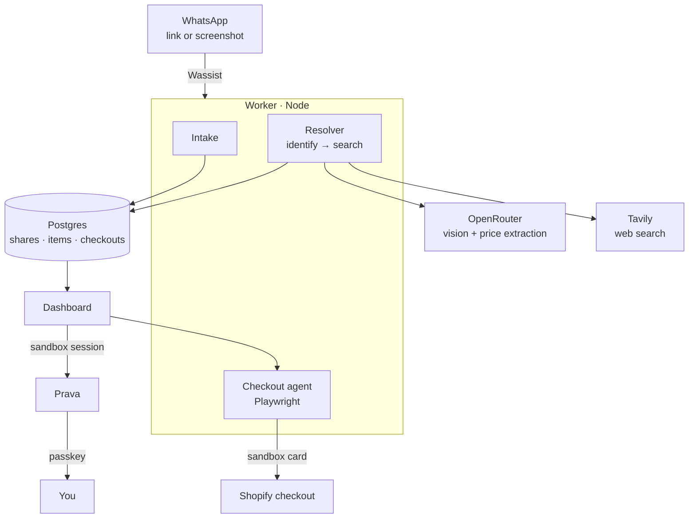

<div align="center">


# sendit

### Send the post. Get the product. Approve a test checkout.

*You message Sendit on WhatsApp with an Instagram or TikTok link, or a screenshot of the product. Sendit names it, finds a real store page, and — when that store can be checked out automatically — hands you a link to approve a [Prava](https://prava.space) sandbox purchase.*

[](https://astro.build)
[](https://www.typescriptlang.org/)
[](https://www.postgresql.org/)
[](https://playwright.dev)
[](https://docs.prava.space)
[](#-license)

</div>

---

## What you do

You see a product in a reel. You send it to the Sendit WhatsApp chat.

Send one of these:

- An Instagram, TikTok, Pinterest, or YouTube link
- A JPEG or PNG screenshot of one product

Sendit replies that it is looking, reads the image, and comes back with a match: title, store, and price.

**Approve** appears only when the match is a store the checkout agent can drive. Today that means Shopify. Tap Approve and Grok opens that store on this Mac, fills the public sandbox test card, and stops before Pay. WhatsApp then shows a demo sale: complete, with an expected delivery window and a link to that outcome. No real order is placed and no money moves.

Any other store comes back **view only**, with **Not this one** and no Approve button. Checkout would stop, so Sendit does not offer it.

Plain text does not start a search. "Find me a black jacket" gets a hint to send a link or a screenshot. A video gets the same request. A link whose preview image cannot be read gets a request for a screenshot. A normal shop URL is ignored.

---

## Where your finds live

The signed link from WhatsApp opens your chat account. Finds, the matched product, and checkout status are on that account.

Signing in on the dashboard with only an email creates or opens a different account. An empty dashboard after that sign-in does not mean the WhatsApp matches disappeared. They are on the chat account. Leave the Instagram handle blank when you are using WhatsApp.

| Page | What you see |
|------|----------------|
| **Finds** | Shares from that account, the frame you sent beside the match |
| **Checkouts** | Sandbox sessions: waiting on the passkey, placed, declined, or unable to finish |
| **Explore** | A separate product browse. It does not search with the same provider as the chat |

---

## How a share is handled

```
WhatsApp ─▶ image ─▶ identify ─▶ search ─▶ match card
                                              │
                         Shopify: Approve ────┴──▶ Grok dry run, stop before pay
                         other stores: view only
```

1. **WhatsApp** — Wassist forwards the message to the worker. The signature is checked, then the share is saved before Sendit replies.
2. **Image** — A screenshot is used directly. A link is used only when its preview image can be downloaded.
3. **Identify** — A vision model returns the brand, product type, colour, material, and a shopping query.
4. **Search** — That query is searched on the web. Prices are read from the page text. If the specific query misses, Sendit tries once more with a coarser description.
5. **Reply** — The best match is sent back in chat. Shopify matches include Approve and Not this one. Other matches are view-only.
6. **Checkout** — Approve launches Grok on this Mac and stops before Pay. The chat shows a demo sale complete, with a delivery window, and a link to the same outcome on the dashboard.

`DEMO_MODE=true` swaps steps 3 and 4 for a fixed catalog after the image is acquired. An unreadable link still asks for a screenshot.

---

## Architecture

The dashboard is an Astro app. The worker is a long-running Node process: it receives webhooks, resolves shares, and drives Chromium, so it cannot be a serverless function. Locally, one worker on port 8787 also proxies the dashboard, so a single public tunnel can serve both the webhook and the checkout link.



| Table | Role |
|-------|------|
| **users** | The account. WhatsApp users get a placeholder email so Prava can open a session |
| **identities** | Platform plus sender. A Wassist chat and a direct Meta WhatsApp chat stay separate even when the phone number matches |
| **shares** | One link or screenshot, its status, and the frame that was read |
| **items** | Ranked matches. `checkoutSupported` decides Approve versus view-only |
| **checkouts** | One Prava session, tied to the signed-in user |

Instagram messaging and the WhatsApp Cloud API adapters are still in the worker. The connected path for this project is Wassist.

---

## Quick start

Read [AGENTS.md](AGENTS.md) for the current machine, then [SETUP.md](SETUP.md) to recreate services. Do not overwrite an existing `.env`.

```bash
pnpm install
pnpm --filter @prava/worker exec playwright install chromium
pnpm db:migrate

pnpm worker     # webhooks, resolver, and checkout agent on :8787
pnpm dev        # dashboard on :4321
```

Point the Wassist webhook at `https://<public-host>/webhooks/wassist`. Set `WEB_ORIGIN` to a dashboard URL your phone can open. `http://localhost:4321` only works on this Mac.

### Environment

```bash
DATABASE_URL=                 # local Postgres for this demo
SESSION_SECRET=               # signs the session cookie and the 15-minute chat links
CHECKOUT_SHARED_SECRET=       # required before the checkout agent will spend a card

DEMO_MODE=false               # true = canned matches after the image is acquired
LLM_PROVIDER=openrouter       # openrouter | openai | xai | nim
OPENROUTER_API_KEY=
IDENTIFY_MODEL=openrouter/free
LLM_FALLBACK_MODELS=openai/gpt-4.1-mini
TAVILY_API_KEY=
SEARCH_PROVIDER=tavily        # or serpapi

WASSIST_API_KEY=
WASSIST_WEBHOOK_SECRET=
WEB_ORIGIN=                   # public dashboard URL used in the Approve link
PRAVA_API_BASE_URL=https://sandbox.api.prava.space
PRAVA_SECRET_KEY=
PRAVA_CALLBACK_URL=           # worker /prava/return, must be https
RETURN_ORIGINS=
```

Direct OpenAI, xAI, NVIDIA, SerpAPI, and Meta credentials are optional. The full list is in [SETUP.md](SETUP.md).

---

## Security and trust

This is a sandbox demo. Do not treat a sandbox decline as a completed purchase, and do not switch the Prava keys to production without meaning to.

The checkout agent spends minted cards. Every call to it needs `x-checkout-secret`. The worker listens on `0.0.0.0`, so that secret matters as soon as a tunnel exposes it.

Sign-in is an email, not a password. The WhatsApp link is the way into the chat account, and anyone with that link can open it until it expires. `/api/payment-result` still returns card credentials to the page; that has to go away before this is public.

---

## Limits

- **Shopify or view-only.** Approve is withheld when the checkout agent cannot drive the store.
- **One clear product.** A collage or a frame with no obvious item comes back as a weak match or no match.
- **Links need a preview image.** If Sendit cannot read it, send a screenshot.
- **Sandbox cards decline** at real merchants. That is the expected end of a test purchase.
- **Captchas and bot walls** stop the agent. With the browser visible, a person can take over a captcha. The agent does not try to beat it.
- **Two accounts.** Email sign-in and the WhatsApp chat are not the same user until that is built.

---

## License

Released under the **MIT License**.

<div align="center">
<sub>Built with <a href="https://docs.prava.space">Prava</a> · <a href="https://astro.build">Astro</a> · <a href="https://playwright.dev">Playwright</a></sub>
</div>
